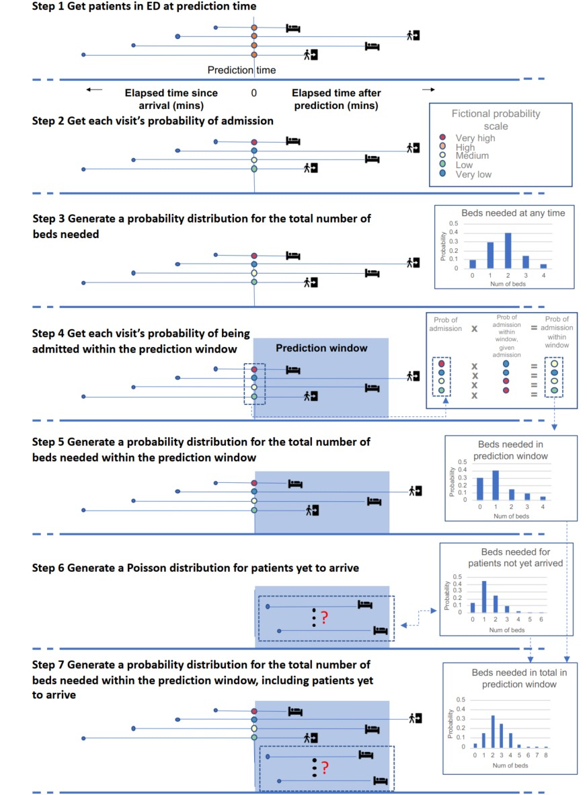
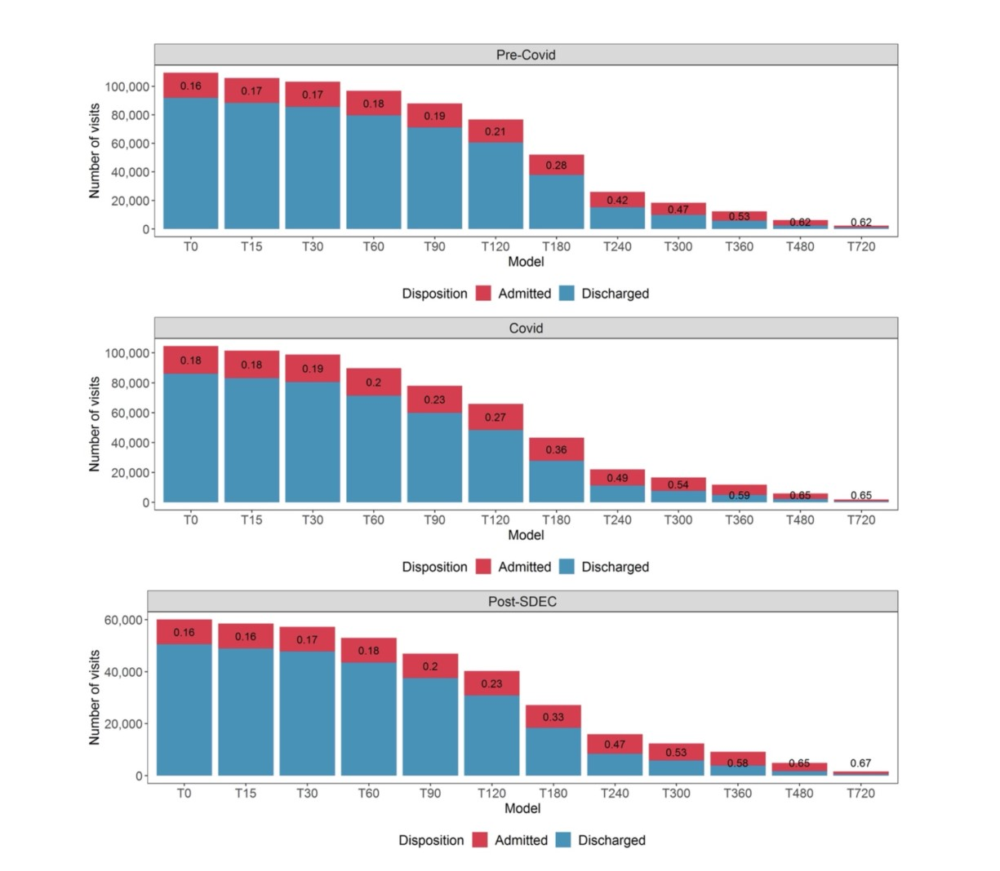

# Machine Learning for Real-Time Aggregated Prediction of Hospital Admission for Emergency Patients
## Summary
- This study presents a pipeline that uses live electronic health-records for patients in a UK teaching hospital ED to generate a short-term, probabilistic forecasts of emergency admissions.
- A set of XGBoost classifiers applied to 109,465 ED visits yielded AUROCs from 0.82 to 0.9 depending on elapsed visit-time at the point of prediction.
- Patient-level probabilities of admission were aggregated to forecast the number of admissions among current ED patients and, incorporating patients yet to arrive, total emergency admissions within specified time-windows.
- Pipeline gave a MAE of 4.0 admissions (MPE 17%) versus 6.5 (32%) benchmark.
- This study discusses how the authors surmounted challenges of designing and implementing models for real-time use, including temporal framing, data preparation, and changing operational conditions.

## Introduction
- With Electronic Health Records (EHRs) and data warehouse capabilities, there is a potential to exploit the promise of AI for operational purposes.
- Currently, most hospitals use simple heuristic to make **short-term forecasts of numbers of emergency admissions**, which are **based on rolling averages** for each day for the week. Scholars suggested improvements using **Bayesian approaches, or auto-regressive inductive moving averages with meteorlogical, public health and geographic data**. **Limitation** Such  methods (i) do not take account of stochastic nature of ED arrivals and (ii) cannot be adapted to reflect the case mix of people in the ED at a given point in time.
- In hospitals with EHRs, where staff are recording patient data at the point of care, there is an opportunity to use EHR data to generate short-horizon predictions of bed demand.
- **Features used for predicting admissions:**
    - Traditional Features:
        - Arrival characteristics: (on foot, or by ambulance)
        - Triage data
        - Prior visit history
    - Recently used features:
        - Medical history
        - Presenting condition
        - pathology 
        - lab test results and procedures

- An important factor is the frequency of acquiring data from a patient. A patient in the resuscitation area of an ED may have frequent observations, while a patient in the waiting room has no data collected. These heterogeneous data profiles are themselves indicative of likelihood of admission.
- Bed planners requested predictions for bed requirements in the next four and eight hours to be sent at four times daily.

## Methods
### Data source
- Data source is HL7 messages generated by Epic, the hospital's EHR system.
- Captured data are issued and stored in Emergency Management Accreditation Program (EMAP), a PostgressSQL and kept up to date with latency less than 5 minutes.
- The database records:
    - Full patient record,
    - including observations, 
    - pathology orders and results,
    - location of patients (demographics?, or location inside the hospital?),
    - consult requests,
    - summary of prior visit history
- Data were analyzed with R version 4.0.0 using MLR3 packages to manage the ML pipeline.
- The study was deemed exempt from NHS Research Ethics Committee review as there is no change to treatment or services or any study randomization of patients into different treatment groups.

### Study population
- All inpatient and emergency visits involving an ED location from 1 May 2019 to 19 July 2021.
- Patients under the age of 18 on the day of admission were excluded (??), as well as those who died(??) and self-discharged 
- After applying preprocessing, 213,985 visits were included. Preprocessing pipeline is shown below

- Analysis was divided into:
    - Precovid
    - During covid
    
- Same Day Emergency Care (SDEC) was introduced in December 2020 with the intention of avoiding unnecessary admission.
- The study models three datasets:
    - Pre-Covid
    - During Covid
    - Post-SDEC

- The training-validation-test sit were split as shown in the following figure:

### Design of prediction pipeline
- Generate bed-level predictions from real-time patient-level data streams.
- Four prediction times in the day use the data from an observation window to make predictions about the number of admissions in prediction windows of 4 and 8 hours.
- The following figure illustrates the temporal detail of the proposed pipeline at a hypothetical moment when four patients were in the ED at the prediction time.

- In the following subsections, the temporal will be explained.

### Steps 1-2: Machine learning for predictions of individual probability of admission
- A series of 12 models, each trained on successively longer elapsed times in ED were created. E.g. model T60 was trained on all visits lasting more than 60 minutes and any data timestamped as recorded within 60 min of the patient's arrival.
    - T60 will be trained only on the data of patients who stayed longer than 60 min in the ED (patients60)
    - T60 will use the data of patients60 that were aggregated within 60 minutes of their arrival.
- Features are described in four groups based on their collection timeline, spanning from the patient's earliest point of arrival to the most recent update:
    - Visit features:
        - Demographics,
        - prior visit history and nature,
        - Timing of the patient's arrival.
    - Location features:
        - patients' location within the ED at the time of the prediction,
        - Locations previously visited
    - Observation and consults features:
        - Triage scores,
        - Vital signals,
        - Use of respiratory support,
        - Other data recorded by staff
    - Pathology features (summarized by counting the number of out-of-range results there were higher, and the number that was lower than the relevant target range for the patient):
        - Requests for sets of lab tests,
        - Latest results on a selection of tests clinically associated with acute illness.
    - Counts of each type of observation and latest values were used as features. Observations were also summarized by counting: How many observations were recorded; how many different types of observations were recorded; how many recording events took place; and how many specialist consultations were requested.

- Based on the duration of waiting in the ED, 12 datasets are made to train each of the 12 classifier. The classes of each of the 12 datasets are shown in the following figure.

- As shown in the previous figure, the longer the patients stay in the ED, the higher chance of them getting admitted.

### Step 3: Agggregation into a probability distribution
- At each prediction time, the probability of admission for every individual in the ED estimated at Step 2 were combined to give a predicted cumulative distribution function (cdf) for the aggregate number of admissions among this group.
- The observed number of admissions associated with each prediction time was mapped to
the midpoint of the relevant portion of its respective predicted cdf.
- A plot of the cumulative distribution of these mapped observations against the predicted cdf was constructed to give
a visual guide to the concurrence between the predicted distributions and the observations analogous to a QQ plot.

### Step 4-5: Survival analysis for time to admission and aggregation
- Survival analysis applied to ED visit durations among admitted patients was used to **estimate the probability of a patient that had been on the ED for a given time being admitted within the prediction window** conditional on them being admitted eventually, with Cox regression used to adjust such probabilities to account for the time of the patient’s arrival (time of day, weekday or weekend, quarter of year) and the occupancy of the ED at that time.
- Dataset containing only admitted patients in the training set period was prepared and Kaplan-Meier survival curve of "survival times" (time from first arrival in an ED location to their departure to an inpatient ward) were calculated. A tail was added to the survival curve using an exponential distribution to allow for the possibility that an admitted patient in the future might remain in the ED for longer than any observations in the training set.
- Cox regression was fitted to the survival curve with **cofficients for factors known to be related to the time it would take patiented to be admitted**.
    - Patient's arrival window (06:00-12:00, 12:00-16:00, 16:00-22:00 and 22:00-06:00)
    - The quarter of year (to reflect seasonal variations)
    - whether patient preswented on a weekday or weekend
    - the number of other patients in various ED locations at the time each patient arrived.
    - **Each variable was scaled prior to inclusion in the COX regression.**

- This analysis was combines with the probabilities of admission estimated at step 2 to give probability for each patient in the ED at the prediction time being admitted within the prediction window.
- These probabilities were then combines to give a predicted cumulative distribution function for the aggregate number of admissions within the prediction window among this group.
-

## Step 6-7: Poisson analysis for patients who have not yet arrived and aggregation.
- 