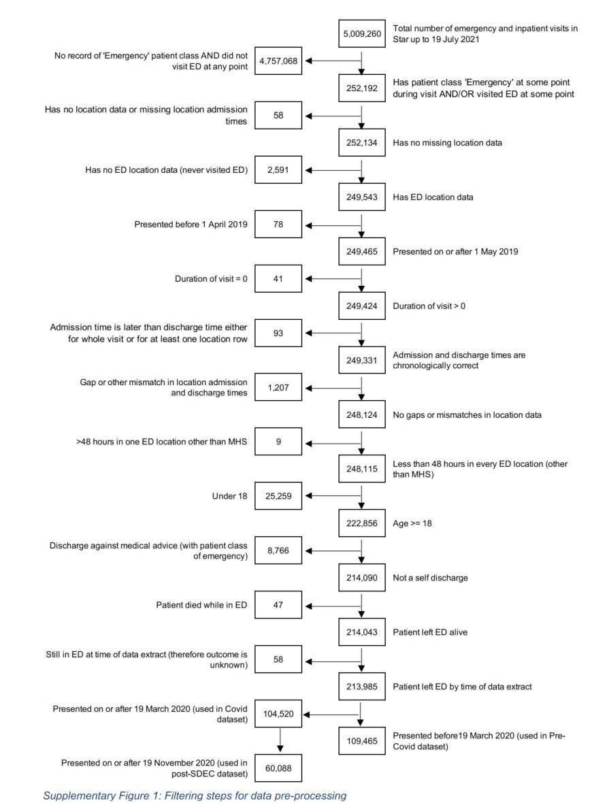
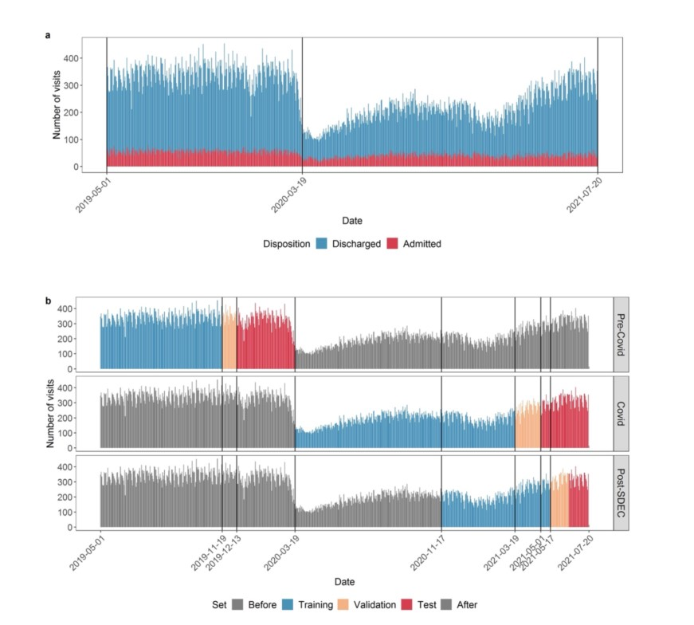

# Machine Learning for Real-Time Aggregated Prediction of Hospital Admission for Emergency Patients
## Summary
- This study presents a pipeline that uses live electronic health-records for patients in a UK teaching hospital ED to generate a short-term, probabilistic forecasts of emergency admissions.
- A set of XGBoost classifiers applied to 109,465 ED visits yielded AUROCs from 0.82 to 0.9 depending on elapsed visit-time at the point of prediction.
- Patient-level probabilities of admission were aggregated to forecast the number of admissions among current ED patients and, incorporating patients yet to arrive, total emergency admissions within specified time-windows.
- Pipeline gave a MAE of 4.0 admissions (MPE 17%) versus 6.5 (32%) benchmark.
- This study discusses how the authors surmounted challenges of designing and implementing models for real-time use, including temporal framing, data preparation, and changing operational conditions.

## Introduction
- With Electronic Health Records (EHRs) and data warehouse capabilities, there is a potential to exploit the promise of AI for operational purposes.
- Currently, most hospitals use simple heuristic to make **short-term forecasts of numbers of emergency admissions**, which are **based on rolling averages** for each day for the week. Scholars suggested improvements using **Bayesian approaches, or auto-regressive inductive moving averages with meteorlogical, public health and geographic data**. **Limitation** Such  methods (i) do not take account of stochastic nature of ED arrivals and (ii) cannot be adapted to reflect the case mix of people in the ED at a given point in time.
- In hospitals with EHRs, where staff are recording patient data at the point of care, there is an opportunity to use EHR data to generate short-horizon predictions of bed demand.
- **Features used for predicting admissions:**
    - Traditional Features:
        - Arrival characteristics: (on foot, or by ambulance)
        - Triage data
        - Prior visit history
    - Recently used features:
        - Medical history
        - Presenting condition
        - pathology 
        - lab test results and procedures

- An important factor is the frequency of acquiring data from a patient. A patient in the resuscitation area of an ED may have frequent observations, while a patient in the waiting room has no data collected. These heterogeneous data profiles are themselves indicative of likelihood of admission.
- Bed planners requested predictions for bed requirements in the next four and eight hours to be sent at four times daily.

## Methods
### Data source
- Data source is HL7 messages generated by Epic, the hospital's EHR system.
- Captured data are issued and stored in Emergency Management Accreditation Program (EMAP), a PostgressSQL and kept up to date with latency less than 5 minutes.
- The database records:
    - Full patient record,
    - including observations, 
    - pathology orders and results,
    - location of patients (demographics?, or location inside the hospital?),
    - consult requests,
    - summary of prior visit history
- Data were analyzed with R version 4.0.0 using MLR3 packages to manage the ML pipeline.
- The study was deemed exempt from NHS Research Ethics Committee review as there is no change to treatment or services or any study randomization of patients into different treatment groups.

### Study population
- All inpatient and emergency visits involving an ED location from 1 May 2019 to 19 July 2021.
- Patients under the age of 18 on the day of admission were excluded (??), as well as those who died(??) and self-discharged 
- After applying preprocessing, 213,985 visits were included. Preprocessing pipeline is shown below

- Analysis was divided into:
    - Precovid
    - During covid
    
- Same Day Emergency Care (SDEC) was introduced in December 2020 with the intention of avoiding unnecessary admission.
- The study models three datasets:
    - Pre-Covid
    - During Covid
    - Post-SDEC

- The training-validation-test sit were split as shown in the following figure:

