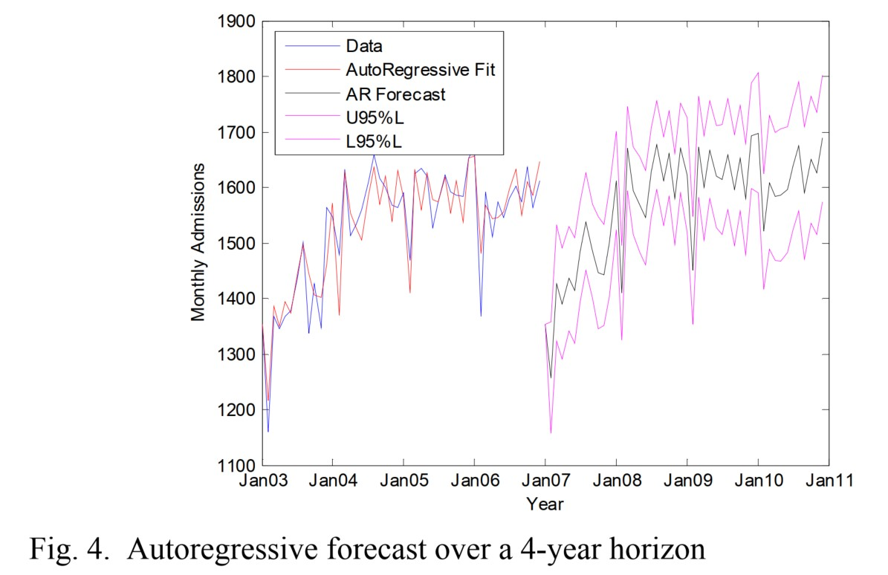

# Regression Forecasting of Patient Admission Data (Justin Boyle, Marianne Wallis, Melanie Jessup, et al.)
### Summary
- This paper analyze patient admission data and forecast this data using regression techniques.
- Data comprises **five years** of ED admission data from **two hospitals**.
- Forecasts made from regression model is compared with observed admission data over a **6-month horizon** (testingset).
- The best method was a **linear regression** using **11 dummy variables** to model **monthly variation (MAPE=1.79%)**
- Similar preformance was achieved with a 2-year average.

### Background
- With experience hospital bed managers can identify which days of the week admissions from ED may reach saturation level because of the **pre-assigned inpatient beds for elective surgery**.
- With the current retrospective, reactive bed management approach, a **common scenario** experienced is the occurence of a **full ED on a Monday morning** and by midday, the hospital has been put on ambulance bypass.
- A typical resolution is to cancel an elective surgery patients at the last minute. (Makes everyone unhappy)
- **Access block** has been shown to impair the function of emergency departments, and lead to less favourable outcomes for patients???
- Prediction the patients inflow to ED will allow booking elective surgery on specific times and days of the year where there is lower demand from ED. (Is this the solution that we are looking for?)
- Several attempts to develop mathematical models to predict the number of likely emergency admission.
    - Bagust et al. model the dynamics of the hospital system using **discrete-event stochastic simulation** using a **MS Excel spreadsheet**. The work concluded that spare bed capactiy is essential for the effective management of ED. (What does this conclusion mean?)
    - Champion et al. used **SPSS Trends package** to automatically identify optimal models to forecast **monthly ED presentations**. **Seasonal exponential smoothing model** provided optimal forecasting performance, and forcasts for the **first five months of 2006** 
    - Reis and Mandle uses **SAS package** to fit **ARIMA** models to nearly a decade of ED presentation data, and report MAPE of 9.37% when validated against the final **2 years of the dataset**.
- The results of the previous studies demonstrate that univariate times series methods can be useful to forecast monthly health data. 

### Data
- ED and admission data are collected from two hospitals in Queensland, Australia. The two hospitals were chosen for their different demographic charactersitics *heterogeneous dataset?*
- A table summarizing **daily presentations** of the two hospitals, **daily admissions**, and **admission rate**.
- Admission rate of one hospital is **20%+/-4%**, the other hospital is **33%+/-5%**.

### Time \& Date Analysis
- Figure 1. shows the mean and 95% CI band for the days of the week (left), and months of analysis (right) for the arrival time of all **presentations**.

- The left plots show that Mondays and weekends have the highest presentations rate for both hospitals.
- The right plots show that over the course of the 5 years, the first hospital has a stable presentations rate while the other one has an **overall increase of 40%**. The population of the city of the second hospital increased by **3.3%** while the first hospital's only 1.3%.
- Figure 2 shows shows the mean and 95% CI band for the days of the week (left), and months of analysis (right) for the arrival time of all **admission**.

- The left plots show that the highest admission is on Sunday, Monday, and Tuesday.
- The right plot shows a similar trend over the year for the presentations plot for the hospital with low population increase. However, the second hospital shows an increase in the admission rate, and then it reaches a platue. Probably, this plateu is due to the saturation of beds and thus, physicians can no longer admit more patients.

### Regression models
- We are interested in **the time at which the admitted patients leave the ED** since it is the time that the patient requries a bed. Thus, this is the data we try to forecast.
- Seasonality was modeleed by including dummy variables in the design matrix as shown in the following table

- The variations of this model:
    - Linear model with 12 monthly dummy variables;
    - Linear model with 11 monthly dummy variables, to assess the potentioal multicollinearity.
    - Quadratic model - containing dummy variables, time, and time-squared.
    - Normalised model - Where data was normalized by the number of days in each month to reduce the effect of shorter months.
    - AR model for the error with two stages:
        - Regression model for original data $y_{t}=(X_{t}\times b)+r_{t}$
        - AR for the resuals $r_{t} = (\rho \times r_{t-1}) + u_{t}$

- ** Four years of admission data were aggregated into monthly totals and used to generate regression fits **
- The following figure shows the linear regression fit with and without dummy variables.

- There was autocorrelation evident between adjacent residuals (measured by plotting the residuals and testing formally with the Durbin-Watson statistic) in all models except the autoregressive model.

- *It is obvious that this forecast horizon is not useful, as the model exhibits the admissions behaviour of the earlier years before the plateau effect. Thus it was desired to assess forecast accuracy using two years instead of four. With this time frame, residuals were not correlated for the models. * (Why?)

- Example forecasts for the six months Jan’07-Jun’07 are shown in the following figure.

- The accuracy of each forecast method is calculated using Mean Absolute Percentage Error (MAPE) defined as:
$$MAPE = \frac{1}{n}\sum_{t=1}^n |PE_{t}|$$
- While $PE_t$ is the Percentage Error of forecasts, defined as:
$$PE_t=(\frac{Y_t-F_t}{Y_t})\times100$$

- The following table and figure shows the accuracy of each model.

### Discussion
- Abdel-Al and Mangoud (https://pubmed.ncbi.nlm.nih.gov/9725649/) describe the estimation of patient volume at month k of year 2007 at family and community medicine primary health care clinic of King Faisal University, Al-Khobar, Saudi Arabia to be 
$$ \hat{A_k(2007)} = \hat{A_k(2006)}\frac{\hat{A_e(2007)}}{\hat{A(2006)}}; k=1,2,...,12$$
- Where $\hat{A(2006)}$ is the actual annual mean for year 2006 and $\hat{A_e(2007)}$ is the extrapolated annual mean for year 2007 as determined from a polynomial fit to data for all available years.
- The forecasted values using a polynomial of order 1 are not as good as the regression models (MAPE=4.73%).
- Also included in the previous Table is the MAPE for a **simple average of the monthly values for the preceding 2 years (ie. Jan’07 = (Jan’05 + Jan’06)/2. It can be seen that this method performs very well at the monthly level.**
- The best model is the linear regression model with 11 dummy variables for monthly variation.